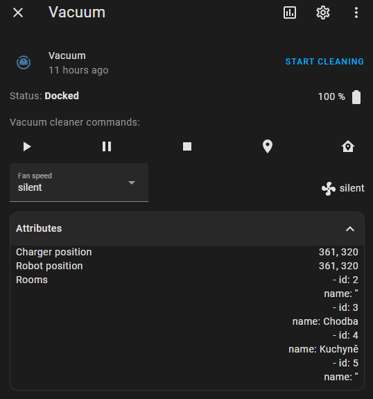
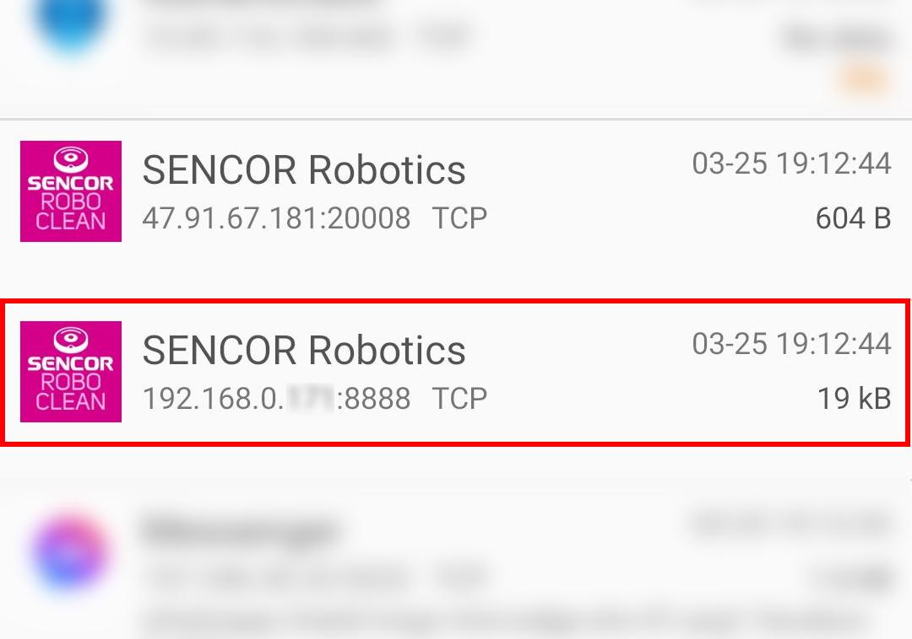
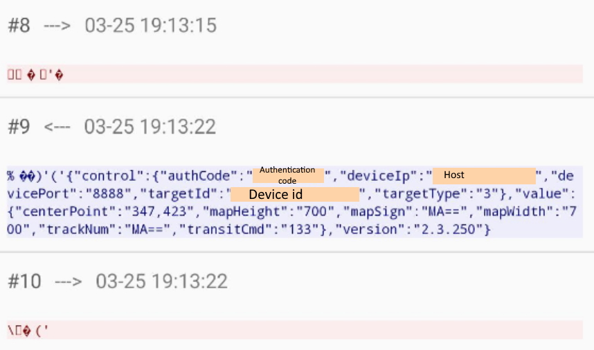

# Home assistant Sencor vacuum integration

The purpose of this integration is to provide an integration of Sencor vacuum.
It allow home assistant to:
- start cleaning
- pause cleaning
- go to dock
- retrieve vacuum informations (battery, state)
- clean specific rooms
- set volume
- locate robot
- clean specific rooms



This integration was tested on Sencor SRV 9200BK.
It should work on many other models (and brand) of vacuums developed by  [Clouds Robot Co.Ltd](https://play.google.com/store/apps/developer?id=Clouds+Robot++Co.Ltd) (Sencor, Cleanmate, Proscenic, ...)


## Installation

### HACS installation

You can use [HACS](https://hacs.xyz/) to install this component. Search for the Integration "Sencor Vacuum"

### Manual installation

1. Go to [releases page](https://github.com/MichalTichy/ha-SencorVacuum/releases)
2. download the last release zip
3. unzip it on `custom_components` directory
4. see next chapter for configuration

## Configuration

Add your device via the Integration menu.

[](https://my.home-assistant.io/redirect/config_flow_start/?domain=sencor_vacuum)


### Get authentifications data

device id, token, user id and authentication code can be retrieved using the SENCOR robotic application :
1. On your android smartphone (no solution for iphone), install [Packet capture](https://play.google.com/store/apps/details?id=app.greyshirts.sslcapture)
2. Open Packet capture and start a capture  select SENCOR  Robotic app
3. Open the SENCOR application, and open the vacuum view
4. Reopen  Packet capture
    1. Click on the first line
    2. Click on the line with local IP 
    3. Get you informations 
5. You can now enter your informations on home assistant
6. You can add your vacuum on lovelace ui entities
    1. You can simply add it as an entity
    2. You can use the [vacuum-card](https://github.com/denysdovhan/vacuum-card)


## Available attributes

Theses attributes are available to be displayed on lovelace-ui:
- `battery_level`: current battery level
- `fan_speed`: last used fan speed
- `charger_position`: possition of charger
- `robot_position`: possition of robot
- `rooms`: List of known rooms

## Available additional services
- sencor_vacuum.clean_rooms
    - Sends vacuum to clean selected room/s.
    ```
    service: sencor_vacuum.clean_rooms
    data:
        rooms:
            - room_id: 4
            clean_num: 1
    target:
        entity_id: vacuum.vacuum
    ```


This integration is heavily based on [Cleanmate integration by Albinmedoc](https://github.com/albinmedoc/ha-cleanmate) and [Proscenic 790T integration by Deblockt](https://github.com/deblockt/hass-proscenic-790T-vacuum)